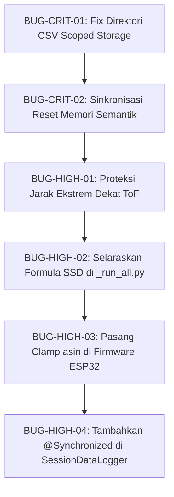

# Laporan Audit Kode & Temuan Potensi Bug — VNetra-Lite

**Tanggal:** 2026-09-03  
**Standar Evaluasi:** `/code-review-and-quality` · `/doubt-driven-development` · `/debugging-and-error-recovery`  
**Cakupan:** Android Kotlin Client (`app/src/main/`), Unit Tests (`app/src/test/`), ESP32 Firmware (`firmware-vnetra.ino`), dan Skrip Analisis Bab 4 (`analysis/output/_run_all.py`).

---

## Ringkasan Eksekutif

Berdasarkan penelusuran baris demi baris (*line-by-line*) dan pengujian skenario adversarial (*doubt-driven check*), ditemukan **2 celah Critical**, **4 celah High/Important**, **4 celah Medium**, dan **1 defisit pengujian**. 

| Severity | Jumlah | Dampak Utama |
|---|---|---|
| 🔴 **Critical** | 2 | *Silent failure* penyimpanan CSV (data skripsi hilang) & pembungkaman alarm rintangan baru (*safety hazard*) |
| 🟠 **High / Important** | 4 | Jarak sangat dekat dianggap aman, inkonsistensi formula matematis Bab 4, potensi crash $\text{NaN}$ di firmware, dan *race condition* I/O |
| 🟡 **Medium / Suggestion** | 4 | *Unbounded loop polling*, kerapuhan *delimiter* pipe BLE, *over-polling* sensor I2C, dan konstanta *hardcoded* |
| 🟢 **Quality / Test** | 1 | Unit test tautologis (`assertTrue(true)`) & nihilnya pengujian komponen *safety manager* |

---

## 🔴 CRITICAL — Harus Diperbaiki Sebelum Pengujian Lapangan

### BUG-CRIT-01: Kegagalan Total Penyimpanan CSV Sesi pada Android 11+ (Scoped Storage)

* **File:** [SessionDataLogger.kt:L92-L103](file:///E:/Project/Skripsi/VNetra-Lite/app/src/main/java/com/airi/vnetra/util/SessionDataLogger.kt#L92-L103)
* **Status:** Aktif di production
* **Dampak:** **Kehilangan seluruh data eksperimen pengujian lapangan (Data Bab 4 Skripsi Kosong).**

#### Analisis Masalah
Aplikasi dikompilasi dengan konfigurasi `compileSdk = 37` dan `targetSdk = 37` pada `app/build.gradle.kts`. Sejak Android 11 (API level 30), sistem operasi memberlakukan aturan *Scoped Storage* secara mutlak, sehingga atribut `android:requestLegacyExternalStorage="true"` di `AndroidManifest.xml` **diabaikan sepenuhnya oleh OS**.

Implementasi pada `SessionDataLogger`:
```kotlin
val dir = android.os.Environment.getExternalStoragePublicDirectory(
    android.os.Environment.DIRECTORY_DOCUMENTS
)
val appDir = java.io.File(dir, "VNetra_Logs")
if (!appDir.exists()) appDir.mkdirs()
val csvFile = java.io.File(appDir, filename)
csvWriter = java.io.FileWriter(csvFile, true)
```
Operasi `java.io.FileWriter` langsung ke direktori publik `/storage/emulated/0/Documents/` tanpa `MANAGE_EXTERNAL_STORAGE` akan melempar eksepsi:
```
java.io.FileNotFoundException: /storage/emulated/0/Documents/VNetra_Logs/...: open failed: EACCES (Permission denied)
```
Karena blok inisialisasi dibungkus dalam `try/catch` tanpa strategi penanganan fallback, variabel `csvWriter` tetap bernilai `null` secara diam-diam (*silent failure*). Pemanggilan `record()` dan `logTestMarker()` selanjutnya gagal mencatat data tanpa memunculkan pesan error di layar.

#### Solusi / Perbaikan
Gunakan direktori penyimpanan spesifik aplikasi (`context.getExternalFilesDir`), yang dijamin dapat ditulis tanpa memerlukan izin runtime storage pada seluruh versi Android (API 26–37):
```kotlin
val dir = context.getExternalFilesDir(android.os.Environment.DIRECTORY_DOCUMENTS)
    ?: java.io.File(context.filesDir, "Documents")
val appDir = java.io.File(dir, "VNetra_Logs")
if (!appDir.exists()) appDir.mkdirs()
val csvFile = java.io.File(appDir, filename)
csvWriter = java.io.FileWriter(csvFile, true)
```

---

### BUG-CRIT-02: Sensor "Membisu" Menghadapi Objek Baru (Deadlock Memori Semantik)

* **File:** [NavigationCoordinator.kt:L144-L151](file:///E:/Project/Skripsi/VNetra-Lite/app/src/main/java/com/airi/vnetra/util/NavigationCoordinator.kt#L144-L151) dan [TtsAlertManager.kt:L256-L270](file:///E:/Project/Skripsi/VNetra-Lite/app/src/main/java/com/airi/vnetra/util/TtsAlertManager.kt#L256-L270)
* **Status:** Aktif di production
* **Dampak:** **Tunanetra berisiko menabrak rintangan baru tanpa peringatan suara (*Safety Hazard Fatal*).**

#### Skenario Kegagalan
1. Pengguna mendeteksi rintangan $A$ di depannya $\rightarrow$ Sistem membunyikan peringatan: *"objek, jarak dekat, arah 12"*.
2. Rintangan $A$ berpindah atau disingkirkan $\rightarrow$ Jalan di depan menjadi kosong ($d_{obj} > T + \varepsilon_{noise}$).
3. Setelah 10 frame berturut-turut (`resetDebounceFrames >= 10`), `TtsAlertManager` mereset `alertFlag = false` dan mengucapkan pesan TTS: *"Jalan di depan kosong"*.
4. **Celah Kritis:** Fungsi `clearObstacleMemory()` pada `NavigationCoordinator` **tidak pernah dipanggil**. Variabel memori semantik:
   $$\theta_{last}, \quad \phi_{last}, \quad \text{Zone}_{last}, \quad \text{dan} \quad d_{last}$$
   tetap membeku merekam status rintangan $A$.
5. Pengguna berhenti sejenak di tempat ($|a_{lin}| \le 1.0\text{ m/s}^2$, sehingga pedometer ruang terbuka `openSpaceWalkFrames` tetap bernilai $0$).
6. Rintangan baru $B$ tiba-tiba muncul di depan pengguna pada sudut yang sama dengan jarak yang serupa ($\Delta d = |d_{last} - d_{obj}| \le 80\text{ mm}$).
7. Evaluasi kondisi kesamaan status semantik menghasilkan nilai `true`:
   $$\text{isSameSemanticState} = \text{true}$$
8. `TtsAlertManager.process()` mengeksekusi percabangan pembungkaman:
   ```kotlin
   if (isSameSemanticState) {
       Log.d(TAG, "Muted by Semantic Memory (Zone & Heading unchanged)")
       return null
   }
   ```
   Peringatan suara dibungkam sepenuhnya. Pengguna tunanetra melangkah dan menabrak rintangan $B$.

#### Solusi / Perbaikan
Tambahkan *callback event* pada `TtsAlertManager` yang dipicu saat zona aman terkonfirmasi bersih, lalu hubungkan ke `NavigationCoordinator`:
```kotlin
// 1. Di TtsAlertManager.kt:
var onClearZoneConfirmed: (() -> Unit)? = null

// Di dalam blok reset (L:261-265):
if (resetDebounceFrames >= 10) {
    alertFlag = false
    resetDebounceFrames = 0
    onClearZoneConfirmed?.invoke()
    speakQueue("Jalan di depan kosong")
}

// 2. Di StreamService.kt (onCreate):
ttsAlertManager.onClearZoneConfirmed = {
    navigationCoordinator.clearObstacleMemory()
}
```

---

## 🟠 HIGH / IMPORTANT — Logika, Fisika, & Formula Matematis

### BUG-HIGH-01: Rintangan Sangat Dekat ($<30\text{ mm}$) Dikelirukan sebagai "Zona Aman"

* **File:** [SpatialMappingUtils.kt:L104-L123](file:///E:/Project/Skripsi/VNetra-Lite/app/src/main/java/com/airi/vnetra/util/SpatialMappingUtils.kt#L104-L123)
* **Dampak:** Rintangan yang menempel tepat di depan sensor kacamata justru mematikan status bahaya.

#### Analisis Matematis
Batas deteksi minimum sistem dikonfigurasi pada:
$$d_{min} = 30\text{ mm}, \quad d_{max} = 4000\text{ mm}$$
Sedangkan pada firmware ESP32, batas filter ditetapkan pada $20\text{ mm}$.
```kotlin
} else if (rawDist in CLOSE_DIST_MIN..CLOSE_DIST_MAX) {
    // Jalur B: Objek ADA di zona bahaya
    ...
} else {
    // Jalur C: Sensor mengukur jarak valid dan AMAN (objek sudah pergi)
    holdoverFrames[i] = 0
    emaDistances[i] = -1f
    rawDist
}
```
Jika sensor ToF membaca jarak ekstrem dekat $d_{raw} \in [0, 29]\text{ mm}$ (misalnya benda menempel pada kacamata):
1. $d_{raw}$ gagal memenuhi syarat Jalur B ($30 \le d_{raw} \le 4000$).
2. Alur eksekusi langsung jatuh ke `else` (Jalur C), yang diasumsikan sebagai *"Objek telah menjauh ke jarak aman"*.
3. Sistem menghapus riwayat *holdover* dan mengatur $d_{EMA} = -1$. Objek berbahaya yang menempel justru diabaikan.

#### Solusi / Perbaikan
Pisahkan penanganan jarak ekstrem dekat ($d_{raw} < d_{min}$) dari jarak aman ($d_{raw} > d_{max}$):
```kotlin
} else if (rawDist in CLOSE_DIST_MIN..CLOSE_DIST_MAX) {
    // Jalur B: Rentang bahaya normal
    ...
} else if (rawDist in 0 until CLOSE_DIST_MIN) {
    // Rintangan menempel ekstrem dekat: kunci ke bahaya maksimum
    holdoverFrames[i] = MAX_HOLDOVER
    emaDistances[i] = CLOSE_DIST_MIN.toFloat()
    CLOSE_DIST_MIN
} else {
    // Jalur C: Objek benar-benar di luar jangkauan aman (> CLOSE_DIST_MAX)
    holdoverFrames[i] = 0
    emaDistances[i] = -1f
    rawDist
}
```

---

### BUG-HIGH-02: Inkonsistensi Formula Stopping Sight Distance (SSD) antara Python dan Kotlin

* **File:** [analysis/output/_run_all.py:L89, L213](file:///E:/Project/Skripsi/VNetra-Lite/analysis/output/_run_all.py#L89) vs [NavigationCoordinator.kt:L235-L238](file:///E:/Project/Skripsi/VNetra-Lite/app/src/main/java/com/airi/vnetra/util/NavigationCoordinator.kt#L235-L238)
* **Dampak:** Validasi koefisien determinasi ($R^2$) pada Gambar 4.2 Skripsi akan rusak/negatif saat dievaluasi menggunakan data log riil.

#### Perbandingan Formulasi Matematis

1. **Implementasi Produksi Android ([`NavigationCoordinator.kt`](file:///E:/Project/Skripsi/VNetra-Lite/app/src/main/java/com/airi/vnetra/util/NavigationCoordinator.kt#L235)):**  
   Mengadopsi prinsip kinematika pengereman biomekanis di mana gaya deselerasi otot kaki **mengurangi** laju luncur langkah:
   $$SSD_{raw} = v_{avg} \cdot (t_R + t_{step}) - \frac{1}{2} |a_{lin}| \cdot t_{step}^2$$
   $$SSD = \max\left(0, SSD_{raw}\right)$$
   $$x = \frac{SSD}{T_{max} - d_0}$$
   $$T = d_0 + (T_{max} - d_0) \cdot \tanh(x)$$
   dengan parameter:
   $$d_0 = 1000\text{ mm}, \quad T_{max} = 4000\text{ mm}, \quad t_R = 1.3\text{ s}, \quad t_{step} = 0.632\text{ s}$$

2. **Implementasi Skrip Evaluasi Python ([`_run_all.py`](file:///E:/Project/Skripsi/VNetra-Lite/analysis/output/_run_all.py#L89)):**  
   Menggunakan formulasi aditif lama yang **menjumlahkan** momentum pengereman dan mengabaikan suku $t_{step}$ pada jarak reaksi:
   $$M_{buffer} = \frac{1}{2} |a_{lin}| \cdot t_{step}^2$$
   $$SSD_{py} = v_{avg} \cdot t_R + M_{buffer}$$
   $$T_{pred} = d_0 + (T_{max} - d_0) \cdot \tanh\left(\frac{SSD_{py}}{T_{max} - d_0}\right)$$

Perbedaan polaritas ($+$ vs $-$) dan offset parameter ini menyebabkan kalkulasi $R^2$:
$$R^2 = 1 - \frac{\sum (T_{actual} - T_{pred})^2}{\sum (T_{actual} - \bar{T}_{actual})^2}$$
menghasilkan nilai yang tidak valid (bisa bernilai negatif) ketika disuplai file CSV aktual dari pengujian Android.

#### Solusi / Perbaikan
Selaraskan model teoritis pada skrip evaluasi Python ([`_run_all.py:L213`](file:///E:/Project/Skripsi/VNetra-Lite/analysis/output/_run_all.py#L213)):
```python
# Diselaraskan dengan model matematis NavigationCoordinator.kt
ssd_actual = np.maximum(0, df['v_avg_mmps'] * (T_R + T_STEP) - df['m_buffer_mm'])
t_pred = D0 + rv * np.tanh(ssd_actual / rv)
```

---

### BUG-HIGH-03: Potensi Crash $\text{NaN}$ pada Estimasi Sikap Mahony AHRS (Firmware ESP32)

* **File:** [firmware-vnetra.ino:L813](file:///E:/Project/Skripsi/VNetra-Lite/firmware-vnetra/firmware-vnetra/firmware-vnetra.ino#L813)
* **Dampak:** Payload UDP mengirimkan nilai `NaN`, merusak filter kecepatan di Android.

#### Analisis Matematis
Konversi orientasi kuaternion ke sudut Euler *pitch* ($\theta$) dinyatakan sebagai:
$$\theta = \arcsin\Big(2(q_w q_y - q_z q_x)\Big) \cdot \frac{180^\circ}{\pi}$$
Secara analitik, fungsi $\arcsin(u)$ hanya terdefinisi pada domain tertutup:
$$u \in [-1.0, \ 1.0]$$
Pada mikrokontroler ESP32 yang mengeksekusi filter integrasi numerik pada frekuensi tinggi, galat pembulatan floating-point (*floating-point truncation*) dapat menyebabkan:
$$u = 2(q_w q_y - q_z q_x) = 1.000002$$
Ketika $u > 1.0$, fungsi `asin(u)` mengembalikan nilai **$\text{NaN}$**. Nilai $\text{NaN}$ ini merambat ke komponen kompensasi rotasi kepala:
$$v_{head\_base} = |\omega_{x\_corr}| \cdot \frac{\pi}{180^\circ} \cdot \cos\left(\theta \cdot \frac{\pi}{180^\circ}\right) = \text{NaN}$$
dan merusak seluruh kalkulasi ambang batas adaptif di Android.

#### Solusi / Perbaikan
Pasang pembatas numerik (*saturating clamp*) sebelum memanggil fungsi `asin`:
```cpp
float sin_theta = 2.0f * (qw * qy - qz * qx);
if (sin_theta > 1.0f) sin_theta = 1.0f;
else if (sin_theta < -1.0f) sin_theta = -1.0f;
float theta = asin(sin_theta) * RAD_TO_DEG;
```

---

### BUG-HIGH-04: Race Condition pada Penulisan `FileWriter` Multithreading

* **File:** [SessionDataLogger.kt:L106-L142](file:///E:/Project/Skripsi/VNetra-Lite/app/src/main/java/com/airi/vnetra/util/SessionDataLogger.kt#L106-L142)
* **Dampak:** Baris CSV terkorupsi (*garbled text*), pemisahan kolom rusak, atau eksepsi `IOException`.

#### Analisis Masalah
Kelas `java.io.FileWriter` tidak menjamin *thread-safety*. Pada arsitektur aplikasi:
1. Thread Coroutine Background (`serviceScope`) memanggil `record()` setiap kedatangan frame ToF ($\sim 15\text{ Hz}$).
2. Thread Utama UI (*Main Thread*) memanggil `logTestMarker()` saat penguji menekan tombol penanda *Ground Truth*.
3. Thread Shutdown memanggil `finalFlush()` saat service dimatikan.

Tanpa mekanisme sinkronisasi, dua thread dapat memanggil operasi buffer `append()` pada instans writer yang sama secara bersamaan, memicu fragmentasi karakter.

#### Solusi / Perbaikan
Tambahkan anotasi `@Synchronized` pada fungsi-fungsi penulisan:
```kotlin
@Synchronized
fun record(frame: SessionFrame) { ... }

@Synchronized
fun logTestMarker(groundTruthLabel: String) { ... }

@Synchronized
fun finalFlush() { ... }
```

---

## 🟡 MEDIUM — Robustness & Clean Architecture

### BUG-MED-01: Polling Koneksi Tanpa Batas Waktu di MainActivity
* **File:** [MainActivity.kt:L220-L246](file:///E:/Project/Skripsi/VNetra-Lite/app/src/main/java/com/airi/vnetra/MainActivity.kt#L220-L246)
* **Masalah:** Coroutine `startAutoConnectCheck()` melakukan *looping* tak terhingga (`while (isActive)`) membuka soket TCP ke port 80 ESP32 setiap 3 detik. Jika modul kacamata dimatikan, proses ini berjalan terus-menerus dan menguras daya baterai HP.
* **Solusi:** Terapkan batas maksimal (misalnya 10 iterasi / 30 detik) sebelum membatalkan proses dengan pemberitahuan kegagalan.

### BUG-MED-02: Kerapuhan Delimiter Pipe (`|`) pada Protokol WiFi BLE
* **File:** [BleManager.kt:L279](file:///E:/Project/Skripsi/VNetra-Lite/app/src/main/java/com/airi/vnetra/ble/BleManager.kt#L279) & [firmware-vnetra.ino:L600](file:///E:/Project/Skripsi/VNetra-Lite/firmware-vnetra/firmware-vnetra/firmware-vnetra.ino#L600)
* **Masalah:** Perintah koneksi dikirim dengan format `CONNECT:SSID|PASSWORD`. Pada firmware ESP32:
  ```cpp
  int sep = creds.indexOf('|');
  ```
  Jika nama SSID mengandung karakter `|`, pemisahan string akan terpotong pada karakter pipe pertama, menghasilkan nama SSID dan password yang salah.
* **Solusi:** Gunakan format URL-Encoding (`URLEncoder.encode`) atau format payload JSON terstruktur.

### BUG-MED-03: Over-Polling Frekuensi I2C Sensor ToF di Firmware
* **File:** [firmware-vnetra.ino:L988](file:///E:/Project/Skripsi/VNetra-Lite/firmware-vnetra/firmware-vnetra/firmware-vnetra.ino#L988)
* **Masalah:** Task `TOF_Task` mengeksekusi `vTaskDelay(pdMS_TO_TICKS(10))` (polling $100\text{ Hz}$), sedangkan sensor VL53L5CX pada resolusi $8 \times 8$ hanya menghasilkan data baru setiap $\sim 66.6\text{ ms}$ ($15\text{ Hz}$). Sekitar $85\%$ siklus penguncian `i2c_mutex` terbuang sia-sia.
* **Solusi:** Tingkatkan waktu tunda polling menjadi $30\text{ ms} - 50\text{ ms}$ atau manfaatkan pin interupsi perangkat keras (*hardware interrupt*).

### BUG-MED-04: Duplikasi Nilai Hardcoded Multiplier Jarak
* **File:** [TtsAlertManager.kt:L190-L193](file:///E:/Project/Skripsi/VNetra-Lite/app/src/main/java/com/airi/vnetra/util/TtsAlertManager.kt#L190-L193)
* **Masalah:** Klasifikasi zona semantik pada `TtsAlertManager` menggunakan nilai literal desimal:
  ```kotlin
  obstacleDistanceMm < adaptiveThresholdMm * 0.5 -> "jarak dekat"
  obstacleDistanceMm < adaptiveThresholdMm * 1.5 -> "jarak sedang"
  ```
  Hal ini menduplikasi konstanta sentral yang telah dipusatkan di [VNetraConfig.kt](file:///E:/Project/Skripsi/VNetra-Lite/app/src/main/java/com/airi/vnetra/util/VNetraConfig.kt#L70-L75).
* **Solusi:** Gunakan `VNetraConfig.ZONE_NEAR_MULT` dan `VNetraConfig.ZONE_MID_MULT`.

---

## 🟢 TEST HYGIENE — Defisit Verifikasi

* **File:** [SessionDataLoggerTest.kt:L30](file:///E:/Project/Skripsi/VNetra-Lite/app/src/test/java/com/airi/vnetra/util/SessionDataLoggerTest.kt#L30)
* **Masalah:** Pengujian unit untuk komponen logger hanya memanggil asersi tautologis:
  ```kotlin
  assertTrue("Race condition exists until @Synchronized is added to SessionDataLogger methods", true)
  ```
  Pengujian ini tidak melakukan eksekusi fungsional apa pun terhadap validitas struktur file CSV, urutan header, atau ketahanan multithread. Selain itu, `TtsAlertManager` belum memiliki berkas uji unit mandiri.
* **Solusi:** Rancang unit test terisolasi menggunakan JUnit `TemporaryFolder` untuk memverifikasi baris serialisasi CSV dan perilaku state machine TTS.

---

## Urutan Prioritas Implementasi Perbaikan



Dokumen ini menjadi acuan verifikasi resmi dalam persiapan pengujian performa akhir prototipe VNetra-Lite.
