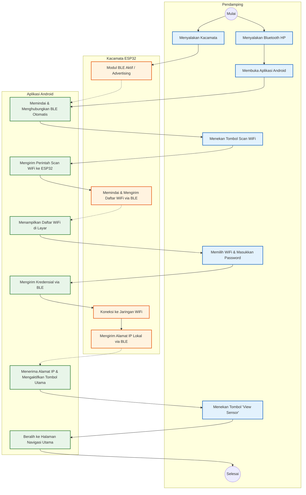
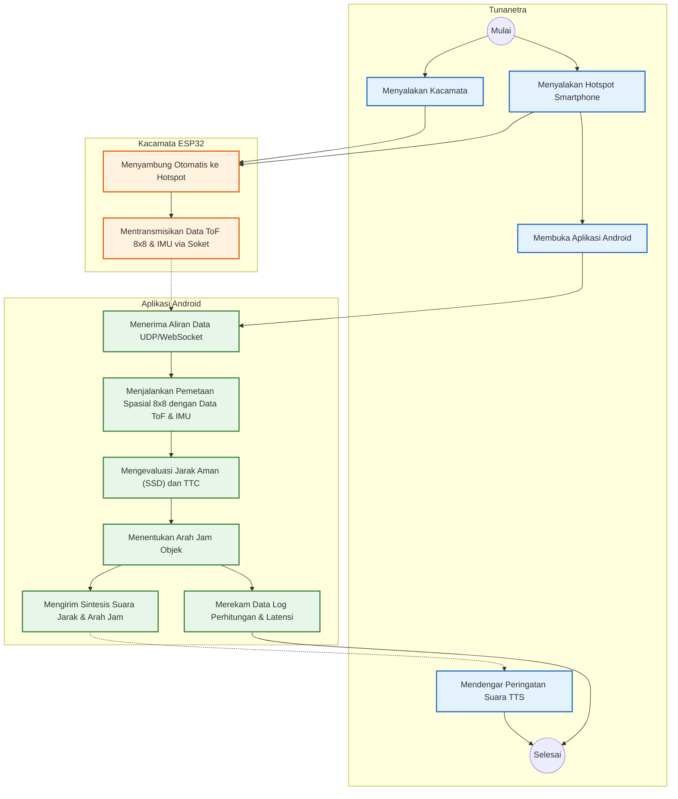

# Diagram Aktivitas (Activity Diagram) VNetra-Lite

Pemodelan alur kerja sistem VNetra-Lite digambarkan menggunakan *Activity Diagram* untuk memperjelas interaksi sekuensial antara pengguna, perangkat keras (Kacamata ESP32), dan Aplikasi Android. *Activity Diagram* pada sistem ini dibagi menjadi dua skenario utama, yaitu skenario konfigurasi jaringan (Provisioning) oleh Pendamping, dan skenario navigasi spasial oleh Tunanetra.

---

## 1. Activity Diagram: Setup Jaringan (Skenario Pendamping)

Berdasarkan gambar di bawah, alur konfigurasi jaringan (*Provisioning*) dimulai ketika Pendamping menyalakan Kacamata ESP32 dan membuka Aplikasi Android. Aplikasi akan melakukan pemindaian (*scanning*) dan terkoneksi secara otomatis dengan Kacamata melalui Bluetooth Low Energy (BLE). Setelah terkoneksi, Pendamping memberikan perintah melalui antarmuka aplikasi agar Kacamata memindai jaringan WiFi yang tersedia. Kacamata kemudian mengirimkan daftar WiFi kembali ke aplikasi untuk dipilih oleh Pendamping. Setelah kredensial WiFi dimasukkan, Kacamata akan terkoneksi ke jaringan lokal (Router/Hotspot) dan mengirimkan Alamat IP lokalnya kembali ke aplikasi sebagai tanda bahwa sistem siap untuk masuk ke tahap pemantauan utama.

---

## 2. Activity Diagram: Navigasi Spasial (Skenario Tunanetra)

Gambar di bawah mengilustrasikan alur pemrosesan navigasi spasial saat sistem dioperasikan oleh Tunanetra. Alur dimulai ketika Tunanetra mengaktifkan Kacamata dan menyalakan Hotspot pada ponsel cerdas, sehingga Kacamata dapat terkoneksi secara otomatis. Saat aplikasi dibuka, Kacamata secara konstan mentransmisikan data matriks Time-of-Flight (ToF) dan Inertial Measurement Unit (IMU) ke aplikasi Android. Aplikasi bertindak sebagai pusat komputasi yang menjalankan algoritma pemetaan spasial dan evaluasi fisika (*Safe Stopping Distance*). Ketika batas jarak aman terlampaui, sistem akan memastikan bahwa data lolos filter *anti-spam* (jeda waktu), lalu merekam log latensi perhitungan, menentukan arah jam dari objek, dan memberikan umpan balik berupa suara *Text-to-Speech* (TTS) melalui *earphone* kepada Tunanetra.

