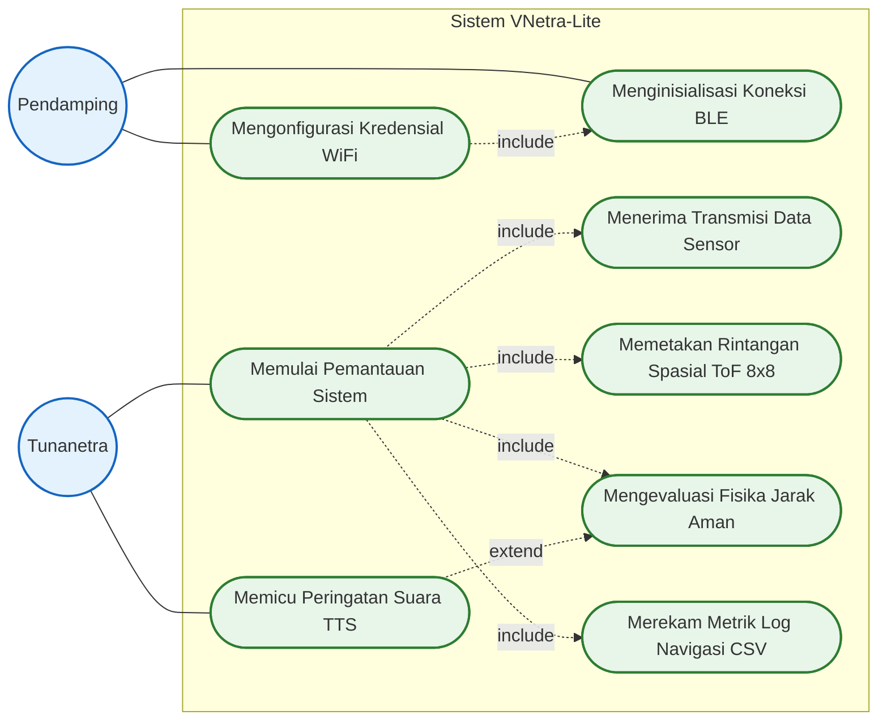

# Use Case Diagram - Sistem Navigasi VNetra-Lite

Dokumen ini menyajikan **Use Case Diagram** untuk sistem instrumen bantu navigasi tunanetra berbasis komputasi spasial (*VNetra-Lite*). Diagram ini memetakan interaksi fungsional antara pengguna, perangkat keras (*ESP32*), dan perangkat lunak (*Aplikasi Android*) berdasarkan implementasi fungsional asli pada kode sumber (*codebase*) sistem.

---

## 1. Definisi Aktor Sistem

Entitas aktor dalam sistem ini diklasifikasikan menjadi dua elemen manusia (Aktor Primer) dan dua elemen mesin (Aktor Sistem).

| Aktor | Jenis | Deskripsi Fungsional |
|---|---|---|
| **Tunanetra** | Primer | Pengguna utama yang berada di luar batasan sistem perangkat lunak. Berinteraksi dengan memberikan perintah (mulai/berhenti) dan menerima informasi bahaya melalui *Text-to-Speech* (TTS). |
| **Pendamping** | Primer | Pengguna sekunder yang membantu konfigurasi awal jaringan (*Provisioning*) melalui *smartphone* via *Bluetooth* agar kacamata dapat terhubung ke aplikasi. |

*(Catatan Standar UML: Perangkat ESP32 dan Aplikasi Android **bukanlah aktor**, melainkan mereka berdua bergabung membentuk **Sistem (System Boundary)** itu sendiri. Segala proses internal di dalam aplikasi seperti perhitungan matriks dan rumus fisika bukan merupakan Use Case, melainkan aktivitas internal sistem yang digambarkan pada Activity Diagram dan Flowchart).*

---

## 2. Diagram Use Case Integrasi

Diagram di bawah ini merangkum fungsionalitas utama sistem VNetra-Lite dari sudut pandang interaksi pengguna luar (aktor), mengikuti kaidah *Unified Modeling Language* (UML) standar.

---

## 3. Rincian Skenario Fungsional (Berdasarkan Use Case)

### Skenario 1: Setup Jaringan (Provisioning)
Modul ini dikendalikan oleh antarmuka aplikasi Android dan **hanya perlu dieksekusi satu kali** saat instrumen berada di lingkungan nirkabel baru. Langkah-langkah kronologis pelaksanaannya meliputi:
1. **Menginisialisasi Koneksi BLE:** Pendamping memanfaatkan antarmuka aplikasi untuk memindai perangkat kacamata yang tersedia, lalu melakukan penyambungan (koneksi) via *Bluetooth Low Energy*.
2. **Memindai dan Mengonfigurasi Kredensial WiFi:** Setelah BLE terhubung, aplikasi memerintahkan kacamata untuk memindai jaringan WiFi di sekitarnya. Pendamping kemudian memilih jaringan yang tersedia dan memasukkan kata sandi (kredensial).
3. **Peralihan ke Proses Utama:** Setelah ESP32 berhasil terhubung ke WiFi dan mendapatkan *IP Address* lokal, aplikasi secara otomatis menyelesaikan proses *setup* dan beralih ke menu utama untuk memulai skenario navigasi (Skenario 2).

### Skenario 2: Pemrosesan Navigasi Spasial
Inti logika berjalan yang diorkestrasi oleh layanan latar belakang aplikasi di bawah komando Tunanetra.
- **Memulai Pemantauan Sistem:** Tunanetra menekan instruksi aktivasi, memicu OS Android untuk menjalankan sinkronisasi data dengan kacamata.
- **Menerima Transmisi Data Sensor:** Sistem, secara otomatis (*include*), menadah aliran paket data berfrekuensi tinggi (IMU dan ToF 64 titik) dari ESP32.
- **Memetakan Rintangan Spasial ToF 8x8:** Sistem menganalisis profil topologi mentah; menyaring *noise* lewat EMA dan mereduksi matriks guna mencari vektor ancaman terdekat.
- **Mengevaluasi Fisika Jarak Aman:** Sistem memadukan laju kecepatan langkah pengguna dan deselerasi melalui operasi fungsi matematis $\tanh$ demi memproduksi Limitasi Adaptif.
- **Memicu Peringatan Suara TTS (Extend):** Bersifat *opsional/kondisional* (relasi `<<extend>>`). Sistem hanya akan mengeksekusi peringatan suara (*Text-to-Speech*) kepada Tunanetra JIKA batas toleransi fisika dari `UC6` terlampaui dan lolos dari filter anti-spam.
- **Merekam Metrik Log Navigasi CSV:** Sistem menyusun struktur data metrik secara hierarkis ke penyimpanan internal guna bahan referensi validasi pada bab evaluasi skripsi.
