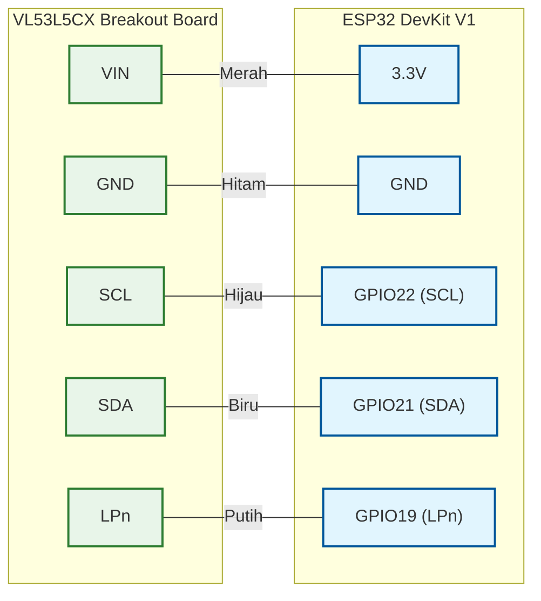
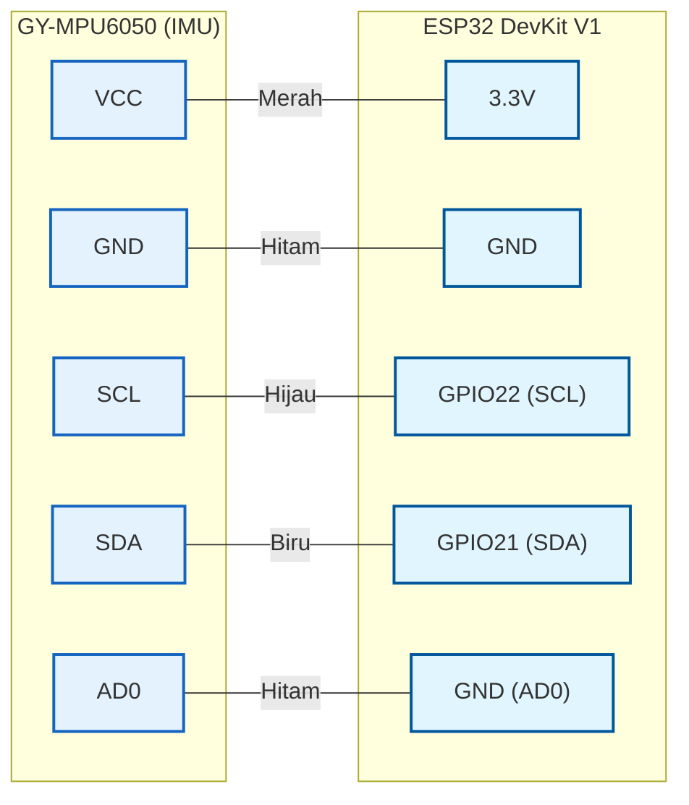
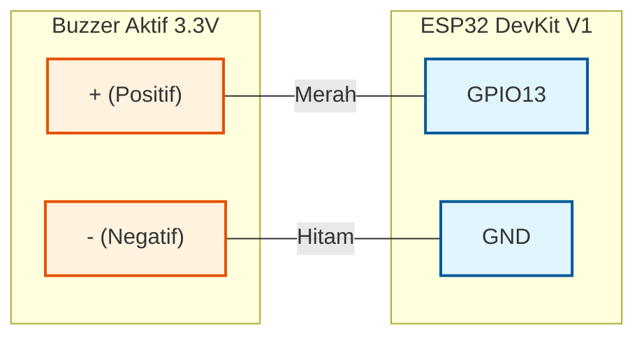
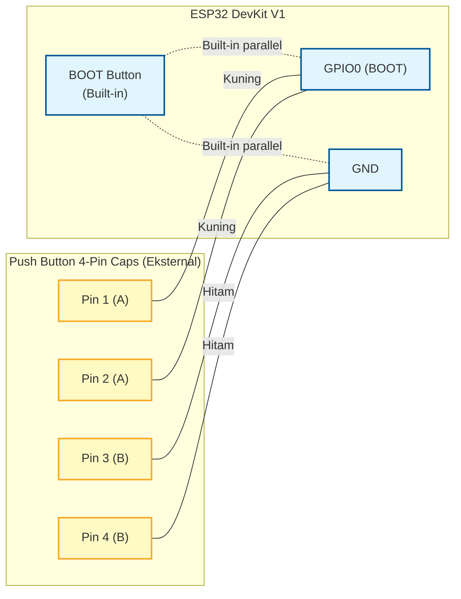
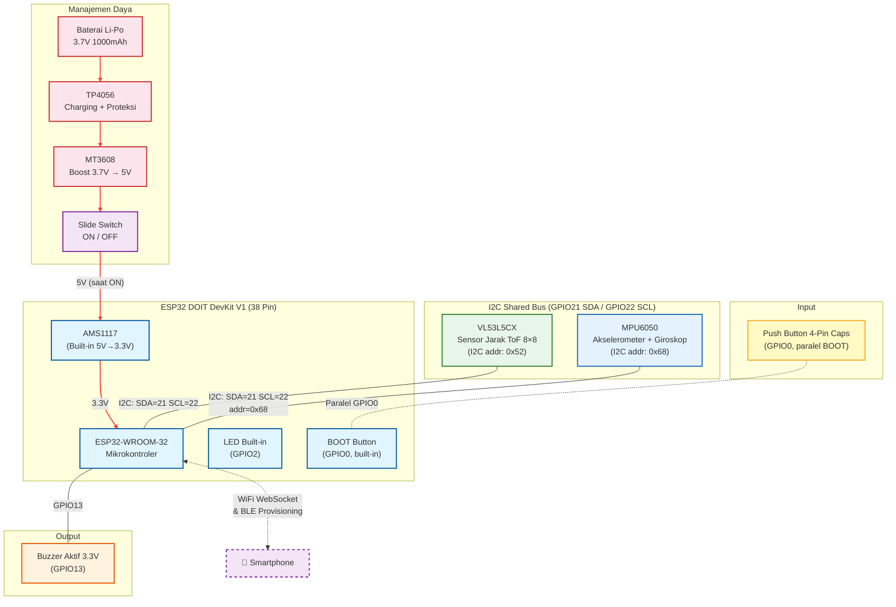

# Wiring Diagram — Perangkat Kacamata Pintar

Dokumen ini menjelaskan skema koneksi (wiring) seluruh komponen hardware pada perangkat wearable berdasarkan implementasi firmware aktual.

**Board yang digunakan:** ESP32 DOIT DevKit V1 — CP2102 TYPE-C 38 Pin (ESP32-WROOM-32)

> **Catatan GPIO ESP32 WROOM-32**: GPIO6–11 terhubung ke SPI Flash internal — **tidak bisa digunakan**. GPIO34, 35, 36, 39 adalah **input-only** (tidak ada pull-up/down internal). GPIO0, 2, 12, 15 adalah strapping pin — hati-hati saat boot.

---

## 1. Pin Mapping — Sensor VL53L5CX (I2C)

Sensor jarak Time-of-Flight VL53L5CX 8×8 terhubung ke ESP32 via **I2C**.



| Pin VL53L5CX | Pin ESP32 | Warna Kabel | Keterangan |
|---|---|---|---|
| **VIN** | **3.3V** | 🔴 Merah | Power supply 3.3V dari board |
| **GND** | **GND** | ⚫ Hitam | Ground |
| **SCL** | **GPIO22** | 🟢 Hijau | I2C Clock (`SCL_PIN = 22`) |
| **SDA** | **GPIO21** | 🔵 Biru | I2C Data (`SDA_PIN = 21`) |
| **LPn** | **GPIO19** | ⚪ Putih | Low Power enable — ditarik HIGH saat boot (`LPN_PIN = 19`) |

**Catatan:**
- Pin **INT** tidak digunakan — sensor dipolling via `checkDataReady()`.
- **LPn wajib HIGH** sebelum inisialisasi agar sensor siap menerima firmware upload ~90KB.
- I2C diinisialisasi firmware: `Wire.begin(21, 22)`.

---

## 2. Pin Mapping — MPU6050 (IMU / Sensor Orientasi Kepala)

MPU6050 menyediakan data orientasi kepala dan akselerasi untuk navigasi. **Berbagi bus I2C** dengan VL53L5CX karena alamat tidak konflik (`0x68` vs `0x52`).



| Pin GY-MPU6050 | Pin ESP32 | Warna Kabel | Keterangan |
|---|---|---|---|
| **VCC** | **3.3V** | 🔴 Merah | Power 3.3V |
| **GND** | **GND** | ⚫ Hitam | Ground |
| **SCL** | **GPIO22** | 🟢 Hijau | I2C Clock — shared bus |
| **SDA** | **GPIO21** | 🔵 Biru | I2C Data — shared bus |
| **AD0** | **GND** | ⚫ Hitam | Alamat `0x68`. Firmware: `mpu.begin(0x68, &Wire)` |

**Catatan:**
- Akses I2C diatur via **FreeRTOS mutex** (`i2c_mutex`) antara `IMU_Task` dan `TOF_Task`.
- Konfigurasi: Accel `±2G`, Gyro `±250°/s`, LPF `21 Hz`.
- **Kalibrasi bias akselerometer** 200 sampel saat boot, hasil di-cache ke NVS.
- **Dynamic Gyro Auto-Reset**: jika diam ≥3 detik, bias giroskop diperbarui otomatis.
- Orientasi terbalik: aktifkan `#define MPU_MOUNTING_INVERTED` di firmware.

---

## 3. Pin Mapping — Buzzer Aktif (Fail-Safe Offline)



| Pin Buzzer | Pin ESP32 | Warna Kabel | Keterangan |
|---|---|---|---|
| **+ (Positif)** | **GPIO13** | 🔴 Merah | `BUZZER_PIN = 13`, HIGH = bunyi |
| **- (Negatif)** | **GND** | ⚫ Hitam | Ground |

**Pola bip Mode Offline** (saat tidak ada client WebSocket):

| Kondisi | Pola |
|---|---|
| Objek mendekat (minDist turun > 50mm) | 3× bip 20ms |
| Objek menjauh (minDist naik > 50mm) | 2× bip 100ms |
| Jalan kosong (minDist ≥ 2000mm) | 2× bip 100ms |

**Catatan:** Gunakan buzzer aktif 3.3V. Jika arus > 12mA, tambahkan transistor NPN (2N2222) sebagai driver.

---

## 4. Tombol — BOOT Button Extend (Push Button 4-Pin Caps)

Tombol BOOT bawaan board (GPIO0) di-**extend** ke luar perangkat menggunakan **push button 4-pin caps** yang dihubungkan secara **paralel**. Tombol eksternal ini memungkinkan pengguna mengakses fungsi multifungsi tanpa harus membuka casing.



**Cara wiring push button 4-pin caps:**

| Pin Tombol | Koneksi | Warna Kabel | Keterangan |
|---|---|---|---|
| **Pin 1 & 2** (sisi A) | **GPIO0** | 🟡 Kuning | Salah satu sisi tombol ke signal line |
| **Pin 3 & 4** (sisi B) | **GND** | ⚫ Hitam | Sisi lainnya ke ground |

> **Cara membaca 4-pin caps**: Pin 1-2 selalu terhubung satu sama lain (satu kontak), Pin 3-4 selalu terhubung satu sama lain (kontak lain). Saat tombol ditekan, kontak A dan B terhubung. Hubungkan **salah satu** dari Pin 1 atau 2 ke GPIO0, dan **salah satu** dari Pin 3 atau 4 ke GND.

**Pola Tekanan dan Fungsi:**

| Pola | Durasi | Fungsi | Feedback |
|---|---|---|---|
| **Tekan singkat** (1×) | < 1 detik | **Mute Toggle** TTS Android | WebSocket: `CMD:TOGGLE_MUTE` |
| **Tekan 2× cepat** | 2× dalam 0.6 detik | **Kalibrasi IMU** — hapus bias NVS, restart | LED built-in 3× blink, `esp_restart()` |
| **Tekan panjang** | ≥ 5 detik | **Reset WiFi** — hapus NVS, BLE provisioning | LED: Orange → Kuning → Merah → Putih 6× → Magenta |

**Catatan:**
- Pull-up internal aktif (`INPUT_PULLUP`). Saat ditekan: GPIO0 = LOW.
- Debounce polling setiap 50ms (`if (millis() - lastPollTime < 50) return`).
- Tombol eksternal bekerja **identik** dengan BOOT button — keduanya paralel, menekan salah satu = menekan keduanya.

---

## 5. Wiring — Manajemen Daya (Li-Po + TP4056 + MT3608 + Switch)

Jalur daya dilengkapi **switch ON/OFF fisik** di antara output MT3608 dan pin 5V ESP32 untuk memudahkan mematikan perangkat tanpa mencabut baterai.

### Jalur Daya

```
Li-Po 3.7V → TP4056 (Charging + Proteksi) → MT3608 (Boost 3.7V → 5V) → SWITCH ON/OFF → Pin 5V ESP32 → AMS1117 (5V → 3.3V)
```



```mermaid
flowchart LR
    subgraph BATERAI ["Sumber Daya"]
        LIPO["Baterai Li-Po<br/>3.7V 1000mAh"]
    end

    subgraph CHARGING ["Modul Charging"]
        TP4056["TP4056<br/>+ Proteksi"]
    end

    subgraph BOOST ["Boost Converter"]
        MT3608["MT3608<br/>3.7V → 5V"]
    end

    subgraph SWITCH_BOX ["Power Switch"]
        SW["Slide Switch<br/>ON / OFF"]
    end

    subgraph ESP32 ["ESP32 DevKit V1"]
        PIN5V["Pin VIN (5V)"]
        AMS["AMS1117<br/>(Built-in)"]
        P3V3["3.3V Rail"]
    end

    LIPO -->|"B+ / B-"| TP4056
    TP4056 -->|"OUT+ / OUT-"| MT3608
    MT3608 -->|"5V"| SW
    SW -->|"ON → lanjut"| PIN5V
    PIN5V --> AMS
    AMS -->|"3.3V"| P3V3

    classDef power fill:#fce4ec,stroke:#c62828,stroke-width:2px;
    classDef sw fill:#f3e5f5,stroke:#7b1fa2,stroke-width:2px;
    classDef mcu fill:#e1f5fe,stroke:#01579b,stroke-width:2px;
    class LIPO,TP4056,MT3608 power;
    class SW sw;
    class PIN5V,AMS,P3V3 mcu;

    linkStyle 0,1,2,3,4,5 stroke:#f44336,stroke-width:2px;
```

### Tabel Koneksi Daya

| Dari | Pin | Ke | Pin | Warna Kabel | Keterangan |
|---|---|---|---|---|---|
| **Li-Po +** | Kabel Merah | **TP4056** | B+ | 🔴 Merah | Positif baterai |
| **Li-Po -** | Kabel Hitam | **TP4056** | B- | ⚫ Hitam | Negatif baterai |
| **TP4056** | OUT+ | **MT3608** | IN+ (VIN) | 🔴 Merah | Output baterai → input boost |
| **TP4056** | OUT- | **MT3608** | IN- (GND) | ⚫ Hitam | Ground |
| **MT3608** | OUT+ (VOUT) | **Switch** | Pin 1 | 🔴 Merah | 5V output → switch masuk |
| **Switch** | Pin 2 | **ESP32** | VIN (5V) | 🔴 Merah | Switch keluar → board |
| **MT3608** | OUT- (GND) | **ESP32** | GND | ⚫ Hitam | Ground bersama (bypass switch) |

### Catatan Penting Daya

- **MT3608 harus di-set ke 5V** terlebih dahulu. Putar trimpot sambil ukur output hingga tepat **5.0V** sebelum pasang ke board.
- **Switch ON/OFF** dipasang di **jalur positif** antara MT3608 VOUT dan pin VIN ESP32 — ground tetap terhubung langsung (tidak diputus).
- Gunakan **slide switch** atau **rocker switch** dengan rating arus ≥ 500mA.
- **TP4056**: colok Micro-USB ke TP4056 untuk isi daya baterai. ESP32 bisa tetap ON saat charging jika switch dalam posisi ON.

### ⚠️ Peringatan: Jangan Hubungkan USB-C dan MT3608 Bersamaan

| Kondisi | Aman? | Keterangan |
|---|---|---|
| Switch ON + MT3608 → VIN (tanpa USB laptop) | ✅ Aman | Mode operasi normal |
| Switch OFF + USB-C ke ESP32 (untuk upload) | ✅ Aman | Mode programming |
| Switch ON + USB-C ke ESP32 bersamaan | ❌ Bahaya | Dua sumber 5V bertabrakan |

**Prosedur upload firmware:**
1. **Matikan** switch ke posisi OFF
2. **Colok** USB-C ke ESP32
3. Upload firmware
4. **Cabut** USB-C
5. **Nyalakan** switch ke posisi ON

---

## 6. Ringkasan GPIO — Seluruh Komponen

### GPIO yang Digunakan Firmware

| GPIO | Fungsi | Komponen |
|---|---|---|
| **GPIO0** | BOOT Button (input, pull-up) | Push Button (built-in + eksternal paralel) |
| **GPIO2** | LED built-in | LED bawaan board DevKit V1 |
| **GPIO13** | Buzzer Output | Buzzer Aktif 3.3V |
| **GPIO19** | LPn Output | VL53L5CX |
| **GPIO21** | I2C SDA | VL53L5CX + MPU6050 (shared bus) |
| **GPIO22** | I2C SCL | VL53L5CX + MPU6050 (shared bus) |

### GPIO Terlarang (Flash Internal)

| GPIO | Status | Keterangan |
|---|---|---|
| GPIO6 | ❌ Flash | SPI Flash CLK — **tidak bisa digunakan** |
| GPIO7 | ❌ Flash | SPI Flash D0 — **tidak bisa digunakan** |
| GPIO8 | ❌ Flash | SPI Flash D1 — **tidak bisa digunakan** |
| GPIO9 | ❌ Flash | SPI Flash D2 — **tidak bisa digunakan** |
| GPIO10 | ❌ Flash | SPI Flash D3 — **tidak bisa digunakan** |
| GPIO11 | ❌ Flash | SPI Flash CMD — **tidak bisa digunakan** |

### GPIO Strapping (Hati-hati saat Boot)

| GPIO | Status | Keterangan |
|---|---|---|
| GPIO0 | ⚠️ Strapping / Terpakai | BOOT button — LOW saat boot = download mode |
| GPIO2 | ⚠️ Strapping | Harus LOW atau float saat boot (LED built-in) |
| GPIO12 | ⚠️ Strapping | Harus LOW saat boot (flash voltage select) |
| GPIO15 | ⚠️ Strapping | Mengontrol JTAG |

### GPIO Tersedia

| GPIO | Status | Catatan |
|---|---|---|
| GPIO4 | ✅ Tersedia | General purpose |
| GPIO5 | ✅ Tersedia | General purpose (default VSPI SS) |
| GPIO13 | ⚠️ Terpakai | Buzzer |
| GPIO14 | ✅ Tersedia | General purpose |
| GPIO16 | ✅ Tersedia | General purpose |
| GPIO17 | ✅ Tersedia | General purpose |
| GPIO18 | ✅ Tersedia | SPI Clock (VSPI) |
| GPIO19 | ⚠️ Terpakai | LPn VL53L5CX |
| GPIO20 | ❌ | Tidak tersedia di DevKit V1 38-pin |
| GPIO21 | ⚠️ Terpakai | I2C SDA |
| GPIO22 | ⚠️ Terpakai | I2C SCL |
| GPIO23 | ✅ Tersedia | VSPI MOSI |
| GPIO25 | ✅ Tersedia | DAC1 |
| GPIO26 | ✅ Tersedia | DAC2 |
| GPIO27 | ✅ Tersedia | General purpose |
| GPIO32 | ✅ Tersedia | ADC1_CH4 / Touch9 |
| GPIO33 | ✅ Tersedia | ADC1_CH5 / Touch8 |
| GPIO34 | ✅ Tersedia | Input only — ADC1_CH6 |
| GPIO35 | ✅ Tersedia | Input only — ADC1_CH7 |
| GPIO36 | ✅ Tersedia | Input only — ADC1_CH0 (VP) |
| GPIO39 | ✅ Tersedia | Input only — ADC1_CH3 (VN) |

---

## 7. Skema Wiring Lengkap



---

## 8. Tabel Wiring Lengkap

| No | Komponen | Pin Komponen | Pin ESP32 | Warna Kabel | Arah | Keterangan |
|---|---|---|---|---|---|---|
| 1 | **VL53L5CX** | VIN | 3.3V | 🔴 Merah | Power | 3.3V dari regulator board |
| 2 | **VL53L5CX** | GND | GND | ⚫ Hitam | Power | Ground |
| 3 | **VL53L5CX** | SCL | GPIO22 | 🟢 Hijau | I2C | I2C Clock (`SCL_PIN = 22`) |
| 4 | **VL53L5CX** | SDA | GPIO21 | 🔵 Biru | I2C | I2C Data (`SDA_PIN = 21`) |
| 5 | **VL53L5CX** | LPn | GPIO19 | ⚪ Putih | Output | Ditarik HIGH saat boot (`LPN_PIN = 19`) |
| 6 | **MPU6050** | VCC | 3.3V | 🔴 Merah | Power | 3.3V dari regulator board |
| 7 | **MPU6050** | GND | GND | ⚫ Hitam | Power | Ground |
| 8 | **MPU6050** | SCL | GPIO22 | 🟢 Hijau | I2C | Shared bus, addr tidak konflik |
| 9 | **MPU6050** | SDA | GPIO21 | 🔵 Biru | I2C | Shared bus |
| 10 | **MPU6050** | AD0 | GND | ⚫ Hitam | Config | Alamat `0x68` |
| 11 | **Buzzer Aktif** | + (Positif) | GPIO13 | 🔴 Merah | Output | HIGH = bunyi (`BUZZER_PIN = 13`) |
| 12 | **Buzzer Aktif** | - (Negatif) | GND | ⚫ Hitam | Power | Ground |
| 13 | **Push Button Ext** | Pin 1 atau 2 | GPIO0 | 🟡 Kuning | Input | Paralel dengan BOOT button |
| 14 | **Push Button Ext** | Pin 3 atau 4 | GND | ⚫ Hitam | Input | Ground |
| 15 | **Slide Switch** | Pin 1 (IN) | MT3608 VOUT | 🔴 Merah | Power | Input 5V dari boost converter |
| 16 | **Slide Switch** | Pin 2 (OUT) | ESP32 VIN | 🔴 Merah | Power | Output 5V ke board saat ON |
| 17 | **Li-Po → TP4056** | B+ / B- | TP4056 B+/B- | 🔴/⚫ | Power | Baterai ke modul charging |
| 18 | **TP4056 → MT3608** | OUT+ / OUT- | MT3608 VIN/GND | 🔴/⚫ | Power | Output charging ke input boost |
| 19 | **MT3608 → ESP32** | GND | GND | ⚫ Hitam | Power | Ground bersama (bypass switch) |

### Ringkasan Komponen

| No | Komponen | Jumlah Kabel | Catatan |
|---|---|---|---|
| 1 | VL53L5CX | 5 kabel | VIN, GND, SCL, SDA, LPn |
| 2 | MPU6050 | 5 kabel | VCC, GND, SCL, SDA, AD0 |
| 3 | Buzzer Aktif | 2 kabel | + ke GPIO13, − ke GND |
| 4 | Push Button 4-pin (ext) | 2 kabel | Paralel GPIO0 + GND |
| 5 | Slide Switch | 2 kabel | Di jalur positif 5V |
| 6 | Li-Po + TP4056 + MT3608 | 6 kabel (antar modul) | Jalur charging dan boost |
| | **Total kabel manual** | **~22 kabel** | |
